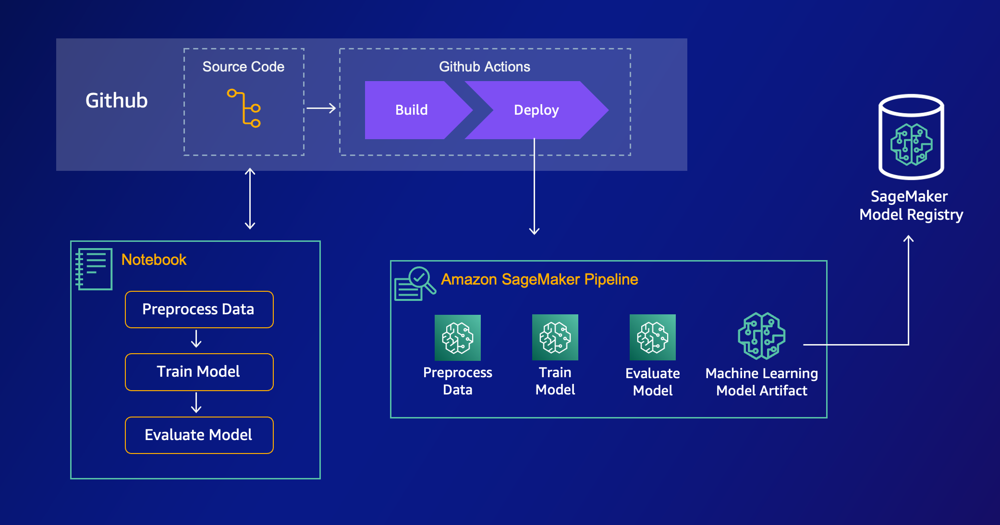

# Custom SageMaker Project with Github Actions

A scaled-down, easy to start with, custom SageMaker Project using Github Actions for building the SageMaker Pipeline.



## Overview

### `/infra`

The cloudformation template used by the Service Catalogue. This is the template that is deployed when a new SageMaker Project is created from within SageMaker Studio.

### `/seed-code`

This is the boilerplate code that's injected into the new GitHub repo which is created when a new SageMaker Project is created.

## Installation

From a high-level, the initial set up involves the following steps:

0. [Configure OpenID Connect in AWS](https://docs.github.com/en/actions/deployment/security-hardening-your-deployments/configuring-openid-connect-in-amazon-web-services) to establish trust between AWS and Github
1. Zip the seed-code and store in S3 for use in downstream repositories.
2. Create a Github Access Token and store it as a secret in AWS Secrets Manager
3. Update the Cloudformation template
4. Create a new product in AWS Service Catalogue, using the cloudformation template in the `/infra` directory. Make sure you're referencing the seed-code you zipped and uploaded to S3 i step 1, in that cloudformation template.
5. Launch a new Sagemaker Project from within SageMaker Studio.

### Zip the seed-code

In the seed-code directory, run

```bash
zip -r ../seed-code.zip .
```

and upload it to s3

```bash
aws s3 cp s3://<your-bucket>/seed-code.zip
```

### Github Access Token

Create two secret in AWS Secrets Manager with the Github Access Token to enable AWS to create GitHub repositories. and to connect the repository to SageMaker Studio

```bash
aws secretsmanager create-secret --name github-access-token --secret-string 'ACCESS_TOKEN_GOES_HERE'
```

```bash
aws secretsmanager create-secret --name github-user-pwd --secret-string '{"username":"<GITHUB_USERNAME>","password":"<ACCESS_TOKEN"}'
```

Note the ARN of the second secret created above, as it needs to be referenced in the `project-template.yml` cloudformation

### Update Cloudformation template

You need to update some parameters in the Cloudformation Template to match your enviromment.

#### The `ProjectRepo` resource.

- You need to update the bucket where you store the zipped seed code and the related object key.
- You need to update the respository owner

#### The `SageMakerRepository` resource.

(note: this resource is only used to have the repo appear in SM Studio. You can delete this resource if you wish)

- You need to enter the ARN of the Secret Manager secret you created with the github username and password.

### Create a new product in Service Catalogue

Follow the instructions [here](https://docs.aws.amazon.com/sagemaker/latest/dg/sagemaker-projects-templates-custom.html) on how to create a new product in Service Catalogue. Make sure to remember adding the tags.

### Launch a new SageMaker Project

In SageMaker Studio, under `Create Project` you should see your custom project under "Organization templates". Launching it deploys the cloudformation.

#### Disclaimer

As of writing this, the integration between SageMaker Studio and Github is bugged. The repo shows up in the SageMaker Project, but it's not possible to clone.
