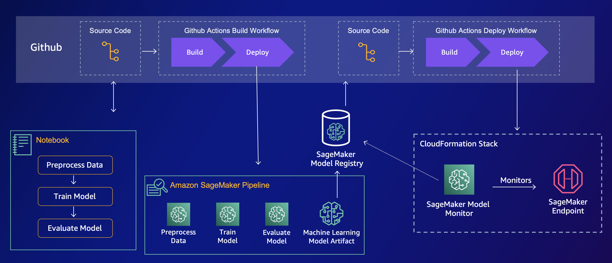

# Custom SageMaker Project with Github Actions

Lean MLOps on AWS, using a custom SageMaker Project with Github Actions for building a SageMaker model training pipeline, and deploying a real-time endpoint using CloudFormation.



## Overview

This project contains the resources to set up a custom SageMaker Project that creates a CI/CD pipeline using Github Actions, that builds a SageMaker Pipeline in AWS.

It contains 2 general components.

### `/infra`

The cloudformation template used by the Service Catalogue. You create a product in the Service Catalogue, and provide this template as the product. This is the template that is deployed when a new SageMaker Project is created from within SageMaker Studio.

### `/seed-code`

This is the boilerplate code that's injected into the new GitHub repo which is created when a new SageMaker Project is created.

## Prerequisites

- A SageMaker Studio domain set up
- SageMaker Projects enabled in that domain.

## Installation

From a high-level, the initial set up involves the following steps:

0. Configure OpenID Connect in AWS to establish trust between AWS and Github
1. Zip the seed-code and store in S3 for use in downstream repositories.
2. Create a Github Access Token and store it as a secret in AWS Secrets Manager
3. Update the Cloudformation template
4. Create a new product in AWS Service Catalogue, using the cloudformation template in the `/infra` directory. Make sure you're referencing the seed-code you zipped and uploaded to S3 i step 1, in that cloudformation template.
5. Launch a new Sagemaker Project from within SageMaker Studio.

### Configure OpenID Connect in AWS

To give Github Actions permissions to assume a role in AWS, [set up OpenID Connect](https://docs.github.com/en/actions/deployment/security-hardening-your-deployments/configuring-openid-connect-in-amazon-web-services). Update the `.github/workflow/build.yml` and `.github/workflow/deploy.yml` to assume the correct IAM role.

### Zip the seed-code

In the seed-code directory, run

```bash
zip -r ../seed-code.zip .
```

and upload it to s3

```bash
aws s3 cp seed-code.zip s3://<your-bucket>/seed-code.zip
```

### Github Access Token

Create a secret in AWS Secrets Manager with the Github Access Token to enable AWS to create GitHub repositories, and to allow the lambda function to use the github API to start the deployment workflow.

```bash
aws secretsmanager create-secret --name github-access-token --secret-string 'ACCESS_TOKEN_GOES_HERE'
```

### Update Cloudformation template

You need to update some parameters in the Cloudformation Template to match your enviromment.

#### Parameters resource.

There are some default cloudformation parameters that needs to be updated.

#### The `ProjectRepo` resource.

- You need to update the bucket where you store the zipped seed code and the related object key.
- You need to update the respository owner

### Create a new product in Service Catalogue

Follow the instructions [here](https://docs.aws.amazon.com/sagemaker/latest/dg/sagemaker-projects-templates-custom.html) on how to create a new product in Service Catalogue. Make sure to remember adding the tags.

### Launch a new SageMaker Project

In SageMaker Studio, under `Create Project` you should see your custom project under "Organization templates". Launching it deploys the cloudformation.
