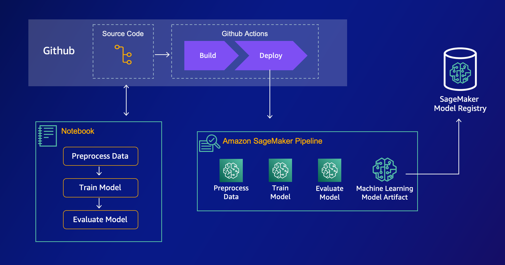

# Custom Sagemaker Project

Scaled down easy to start with custom SageMaker Project that creates a SageMaker Pipeline based on the contents of the `algorithms` directory, using Github Actions. Below is a diagram of the system.

## Overview

### `algorithms/`

All the steps of the SageMaker Pipeline. Each sub-directory contains the script to run and some configuration for that particular step.

### `notebooks/`

All the notebooks of the project. Used by the data scientist for exploratory data analysis. Write the relevant scripts from the notebook into the corresponding directory under `algorithms`

### `training_pipeline/`

The `build.py` script is run in the CD pipeline, creating or updating the SageMaker Pipeline that's defined in the `algorithms` directory. Iterate on this code to add support more configuration options, more step types, custom images and so on.
