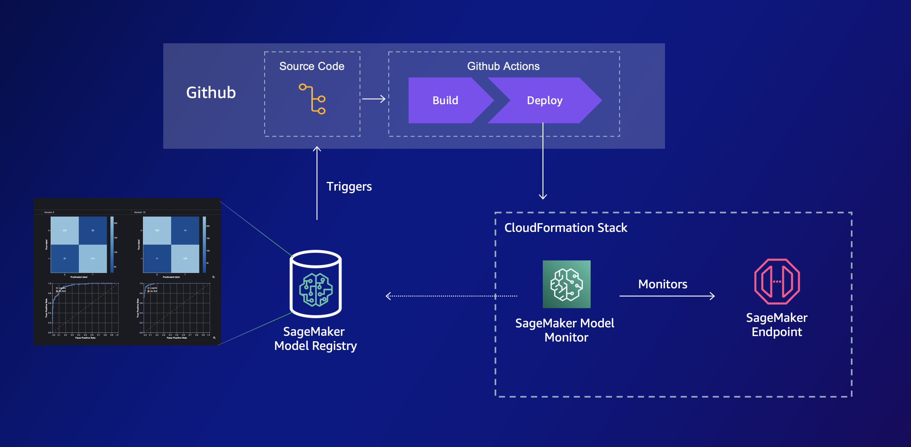

# Deploy models with Github Actions and CloudFormation

> **[`Nota Bene!`](./template.yml)**
> This CloudFormation template contains a Lambda function (`InvokeEndpointFunction`) that invokes the endpoint with static data, specific to the dataset I used in building this demo. This is to generate monitoring data for demo purposes and will break your deployment if you don't remove the Lambda function.

Deploy workflow that fetches the latest approved model from model registry, and deploys a real-time SageMaker endpoint with data-drift and SHAP value monitoring.

